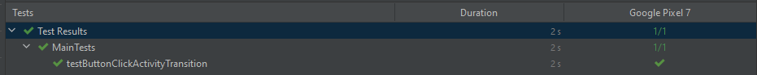
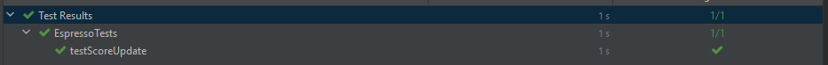
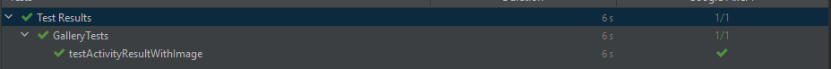

NB! Burde brukes i darkmode, ellers ser man ikkje tekst under bilder i galleriet. Gidder ikkje fikse dette nå

# Tests
### Main Activity Test
> Clicks the gallery button and checks that the display is indeed "Gallery" afterwards

### Quiz Test
> Initializes the viewModel in the application context to avoid errors down the line as this is normally done in the main activity
> Launches the quiz activity and gets the current "answer"
> Collects rounds played / won from the shared preferences
> Selects the correct option based on the name of the current answer
> Collects rounds played / won from the shared preferences again
> Compares the score before and after and returns the result
>> this should in most cases work unless the name is somehow altered when put on the button.

### Gallery Test
> Initializes the viewModel in the application context to avoid errors down the line as this is normally done in the main activity
> Launches the Gallery activity
> Gets the size of the image list before a new entry
> Creates a mock URI
> Types "Mock Name" into the name field
> Sets the mock URI as result data from the next ACTION_OPEN_DOCUMENT intent
> Clicks the button that will use this intent to collect an image
> Clicks the submit button
> Compares the current size of the image list with the previous size
>> if the image didn't exist before, it should return true

